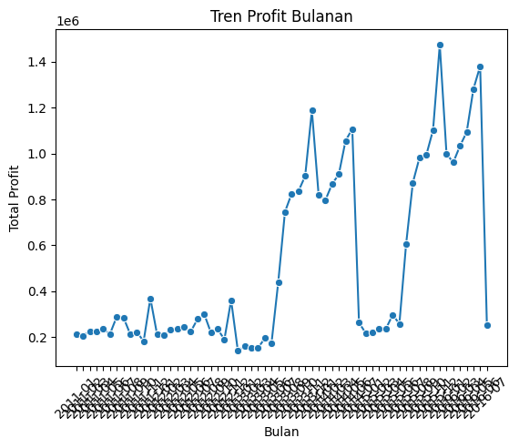
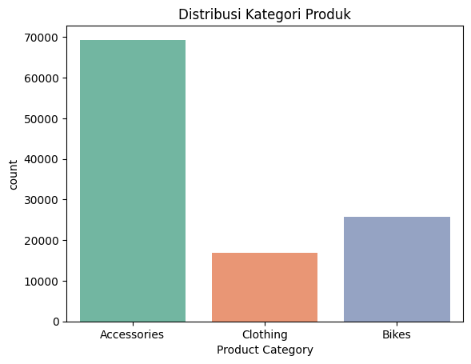
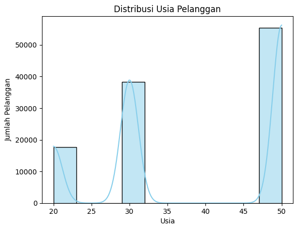
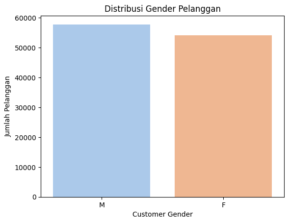
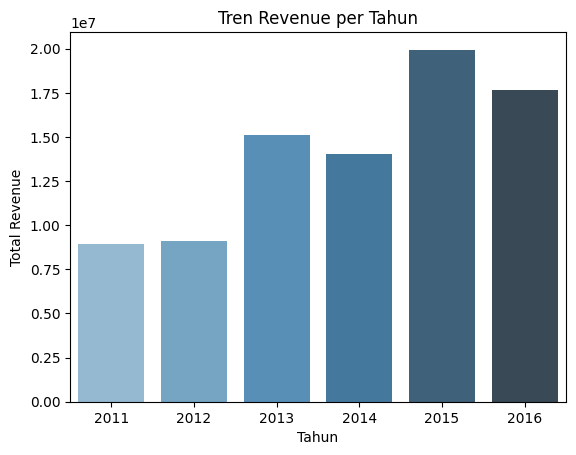

# 🚴‍♂️ Bike Sales Capstone

Proyek analisis data penjualan sepeda untuk memahami pola pembelian pelanggan berdasarkan usia, gender, dan kategori produk.  
Hasil project ini berupa **analytical result, insight & findings**, serta **recommendations** yang dapat membantu strategi penjualan sepeda.

---

## 📂 Dataset
- **Sumber**: [Bike Sales Dataset](https://drive.google.com/drive/folders/1mQ1-0lJJkPA1Gl2KYdXsCNr-5DF_juKT?usp=sharing) | [Kaggle Notebook](https://www.kaggle.com/code/ahmedterry/bike-sales-analysis/notebook)  
- **Jumlah data**: ±82.000 records  
- **Kolom utama**: Customer Age, Age Group, Customer Gender, Country, Product Category, Sub Category, Product, Order Quantity, Revenue, Profit, dsb.  

---

## 📊 Visualizations
### Tren Profit Bulanan


### Distribusi Kategori Produk


### Distribusi Gender & Age Group



### Revenue & Profit Patterns


 

---

## ✅ Output

### 🔹 Analytical Result
- Data cleaning & preprocessing dengan **Python** (`pandas`, `numpy`)  
- Visualisasi menggunakan **matplotlib & seaborn**  
- **Rata-rata usia pelanggan**: ±38 tahun  

### 🔹 Insights & Findings
- **Kelompok pembeli terbesar**: Usia 30–50 tahun (Adults & Young Adults)  
- **Pendapatan tinggi** → lebih cenderung membeli sepeda  
- **Perbedaan gender**: Pria sedikit lebih banyak membeli, tetapi preferensi produk mirip  
- High-value customers identified untuk strategi retention & upselling  

### 🔹 Recommendations
- Fokus kampanye marketing ke kelompok usia 30–50 tahun  
- Paket cicilan atau promo untuk segmen pendapatan menengah  
- Strategi pemasaran berbeda untuk pria & wanita (contoh: sepeda sport vs sepeda city)  
- Loyalty programs, personalized marketing, upselling & cross-selling  

---

## 🛠️ Tech Stack
- Python (`pandas`, `numpy`, `matplotlib`, `seaborn`)  
- Jupyter Notebook / VS Code  
- **LangChain + IBM Granite LLM** untuk insight & rekomendasi marketing  
- Git & GitHub  

---

## 🚀 Cara Menjalankan
```bash
git clone https://github.com/fahranirusziady/bike-sales-capstone.git
cd bike-sales-capstone
# Install dependencies
pip install -r requirements.txt
# Jalankan Jupyter Notebook
jupyter notebook notebooks/bike_sales_analysis.ipynb

## ✨ Author
**Fahrani Rusziady**  
🌐 [GitHub](https://github.com/fahranirusziady) | 💼 [LinkedIn](https://linkedin.com/in/fahranirusziady) | ✉️ fahranirusziady@gmail.com
