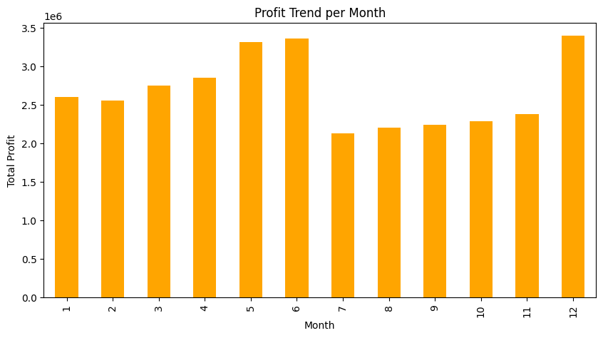
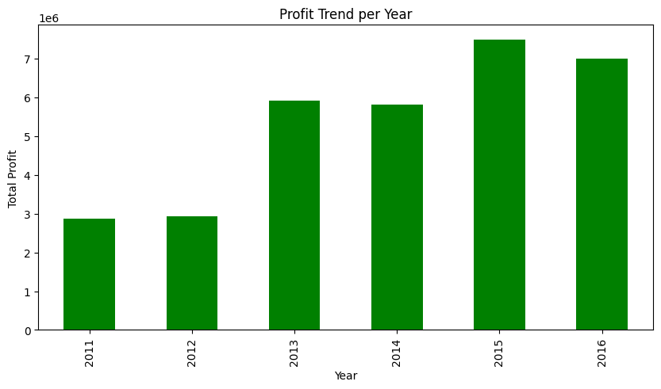
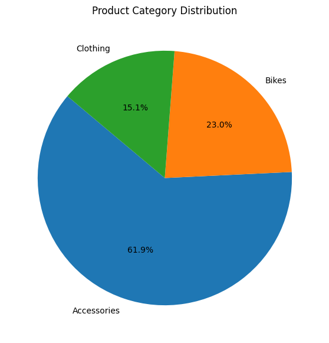
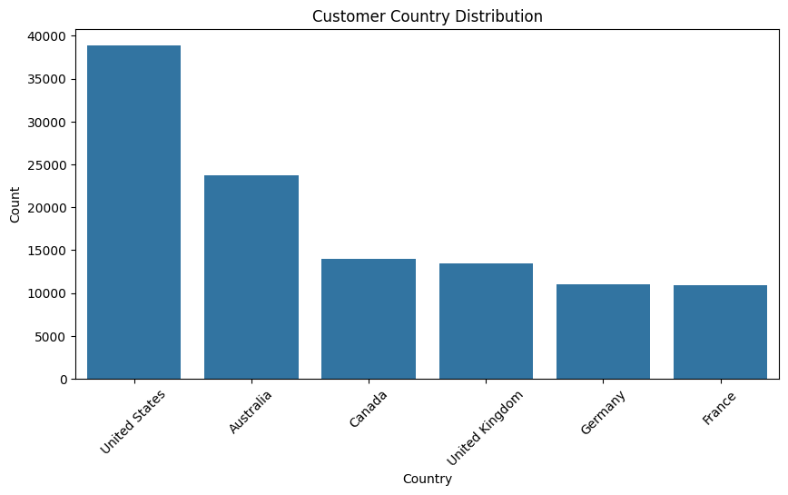
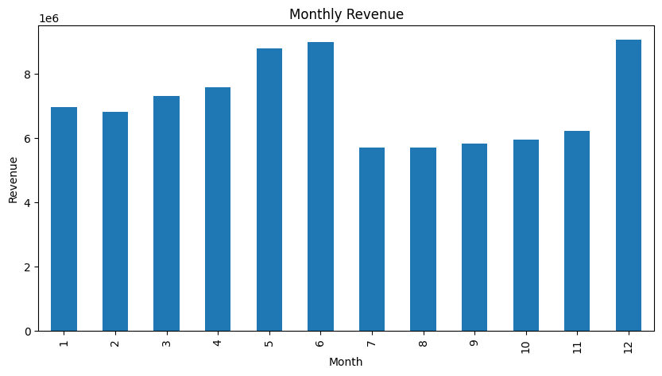
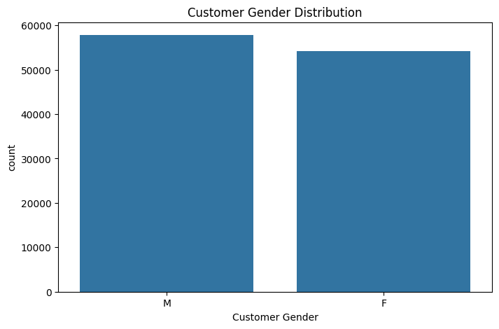

# 🚴‍♂️ Bike Sales Capstone

Proyek analisis data penjualan sepeda untuk memahami pola pembelian pelanggan berdasarkan usia, pendapatan, dan faktor lain.  
Hasil project ini berupa **analytical result**, **insight & findings**, serta **recommendations** yang dapat membantu strategi penjualan sepeda.

---

## 📂 Dataset
- **Sumber:** [Bike Sales Dataset](https://drive.google.com/drive/folders/1mQ1-0lJJkPA1Gl2KYdXsCNr-5DF_juKT?usp=sharing
https://www.kaggle.com/code/ahmedterry/bike-sales-analysis/notebook)  
- **Jumlah data:** ±1.000 records  
- **Kolom utama:** Age, Income, Gender, Purchase, dsb.

---

## 📊 Visualizations

### Profit Trend Month


### Profit Trend Pendapatan


### Product Category Distribution


### Customer Country Distribution


### Monthly Revenue


### Customer Gender Distribution


---

## ✅ Output

### 🔹 Analytical Result
- Data cleaning & preprocessing dilakukan dengan Python (pandas, numpy).  
- Visualisasi menggunakan matplotlib & seaborn.  
- Statistik deskriptif menunjukkan rata-rata usia pelanggan ±35 tahun.  

### 🔹 Insights & Findings
- Usia 30–40 tahun = kelompok pembeli terbesar.  
- Pendapatan tinggi → lebih cenderung membeli sepeda.  
- Pelanggan pria sedikit lebih banyak membeli dibanding wanita.  

### 🔹 Recommendations
- Fokus kampanye marketing ke kelompok usia 30–40 tahun.  
- Paket cicilan untuk segmen pendapatan menengah agar meningkatkan konversi.  
- Strategi pemasaran berbeda untuk pria & wanita (contoh: sepeda sport vs sepeda city).  

---

## 🛠️ Tech Stack
- Python (pandas, matplotlib, seaborn)  
- Jupyter Notebook  
- GitHub  

---
## 🚀 Cara Menjalankan  
1. Clone repository:  
   ```bash
   git clone https://github.com/fahranirusziady/bike-sales-capstone.git
   
## ✨ Author
**Fahrani Rusziady**  
🌐 [GitHub](https://github.com/fahranirusziady) | 💼 [LinkedIn](https://linkedin.com/in/fahranirusziady) | ✉️ fahranirusziady@gmail.com  
